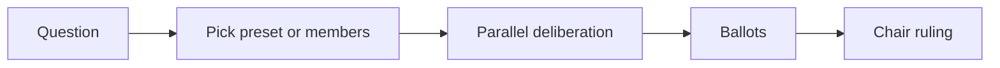

# LLM Council

[](LICENSE)

**Multi-model deliberation for developers** — in Cursor chat, Claude Code, or via Cursor Automations.

Five (or fewer) models debate your question in parallel, vote, and produce a binding ruling. No SDK. No API keys. No `npm install`.

```
council: Should we ship feature X this sprint?
council @security: Expose the admin API without VPN?
```

## Why

| You need | LLM Council gives you |
|----------|------------------------|
| A second opinion | Five, from different models |
| A decision record | Chair ruling + vote tally |
| Low friction | One line in chat, or a webhook POST |

## Quick start (Cursor)

```bash
git clone https://github.com/kioie/llm-council.git
cd llm-council
./install.sh
```

Then in any project:

```
council: Migrate to passkeys before GA?
```

Or `@COUNCIL.md` + your question.

## Pick your council

### Presets

| Preset | Command | Seats |
|--------|---------|-------|
| Engineering (default) | `council: …` | Architect, Engineer, Strategist, Pragmatist, Chair |
| Product | `council @product: …` | PM, Design, Growth, Eng liaison, Chair |
| Security | `council @security: …` | AppSec, Infra, Privacy, Pragmatist, Chair |
| Minimal (fast) | `council @minimal: …` | Builder, Skeptic, User, Chair |

### Create your own members

```bash
mkdir -p .llm-council/members
cp members/member.example.yaml .llm-council/members/alex.yaml
# edit alex.yaml, then add to .llm-council/roster.yaml
```

In chat:

```
council roster: create member
```

See [members/README.md](members/README.md).

### Swap models inline

```
council engineer=gpt-5.2 chair=claude-4.6-opus-high-thinking "GraphQL or tRPC?"
```

Use whatever models your Cursor plan supports.

## Modes

| Mode | Command | What runs |
|------|---------|-----------|
| Quick | `council quick: …` | Opinions → short ruling |
| Full | `council: …` | Deliberate → vote → ruling |
| Deep | `council deep: …` | Two deliberation rounds → vote → ruling |

## Cursor Automation

Run council from a webhook or the Automations UI — no chat required.

```bash
./install.sh --automation
```

Import [automations/llm-council-webhook.workflow.json](automations/llm-council-webhook.workflow.json) in **Cursor → Automations**, or ask your agent to open it.

**POST after save:**

```bash
curl -X POST "$WEBHOOK_URL" \
  -H "Authorization: Bearer $TOKEN" \
  -H "Content-Type: application/json" \
  -d '{
    "question": "Adopt event sourcing for billing?",
    "preset": "engineering",
    "mode": "full"
  }'
```

**PR review** — comment `/council` on a PR using [automations/llm-council-pr.workflow.json](automations/llm-council-pr.workflow.json).

Details: [automations/README.md](automations/README.md)

## Claude Code

Same templates, no Task parallelism. See [claude/COUNCIL.md](claude/COUNCIL.md).

## Project layout

```
.cursor/skills/llm-council/   # Cursor skill (orchestration)
COUNCIL.md                    # @-mention entry point
presets/                      # engineering, product, security, minimal
members/                      # create-your-own member templates
templates/                    # deliberation, ballot, ruling prompts
automations/                  # Cursor Automation workflow JSON
.llm-council/                 # your local roster (gitignored)
```

## How it works



Cursor runs phases via parallel **Task** subagents — one per council seat, each on the model you assigned.

## Contributing

PRs welcome — especially new presets and automation triggers. See [CONTRIBUTING.md](CONTRIBUTING.md).

## License

MIT — [LICENSE](LICENSE)
